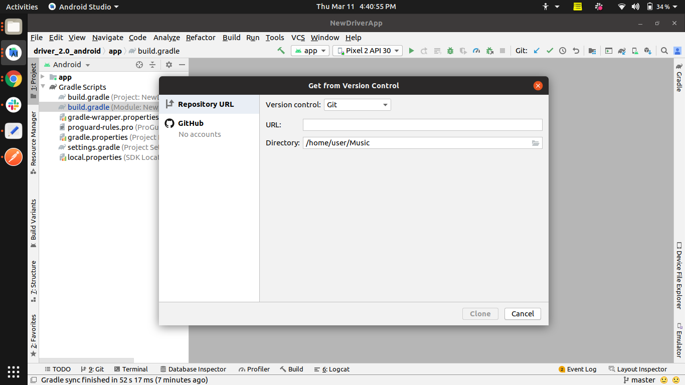
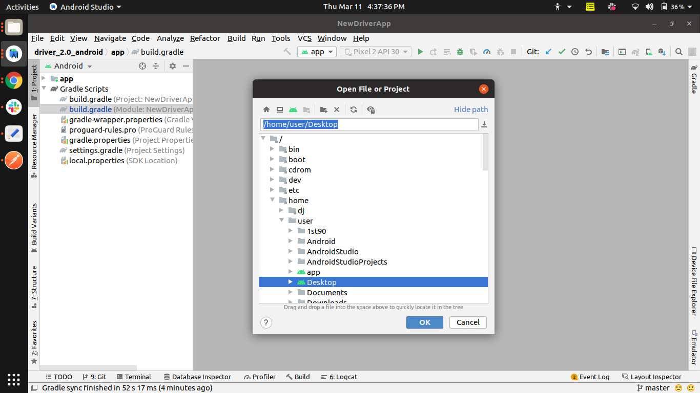
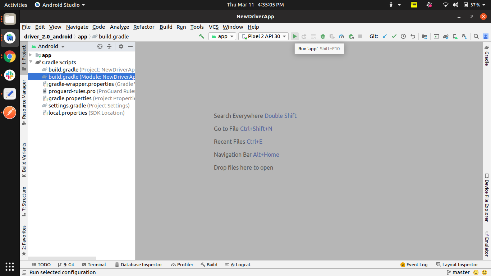
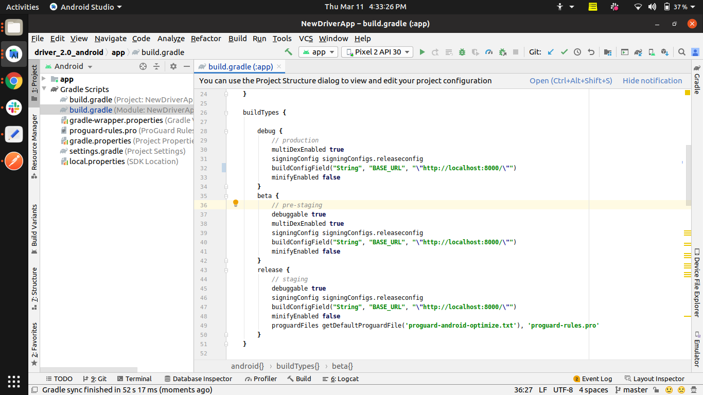

*Take pull from Github/BitBucket*

    git clone https://ami_bajwala@bitbucket.org/ami_bajwala/driver_2.0_android.git

*Install Android Studio and setup all necessary SDKs*

    https://www.geeksforgeeks.org/guide-to-install-and-set-up-android-studio/

*Now open the project repository downloaded from bitbucket, the dependencies will be downloaded automatically*

*Once the dependencies are downloaded, hit the “Run” button to run the project*

*To setup Google authentication, click on the below link and follow the given steps*

    https://firebase.google.com/docs/auth/android/google-signin

Upon following all the steps from the above link, you will have to change the base URL
path from the localhost to IP/domain name through the build.gradle file of the application
and set the build variants accordingly and click on “Sync Now” on the right-hand side of
the top menu bar.

*Now the project is good to go and you can run the application*
