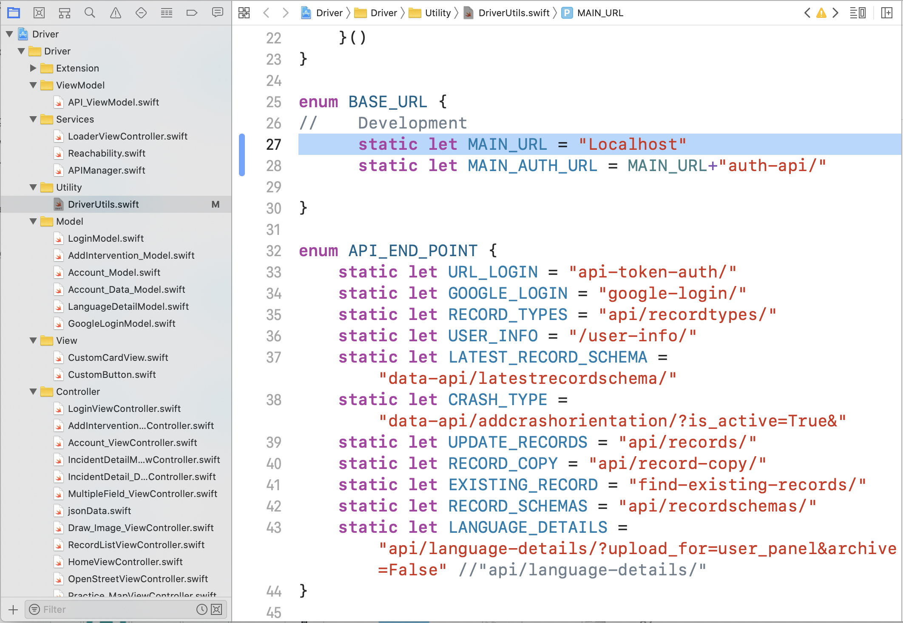
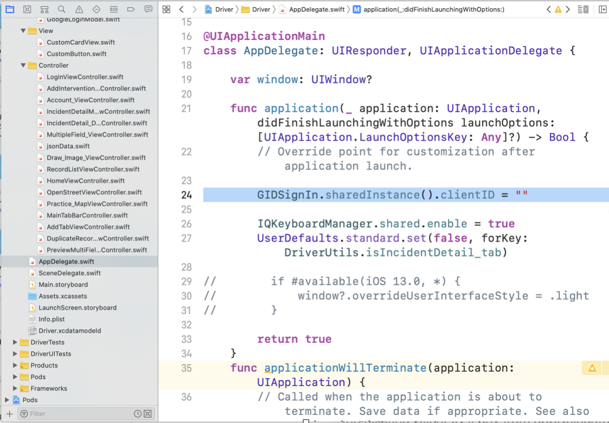
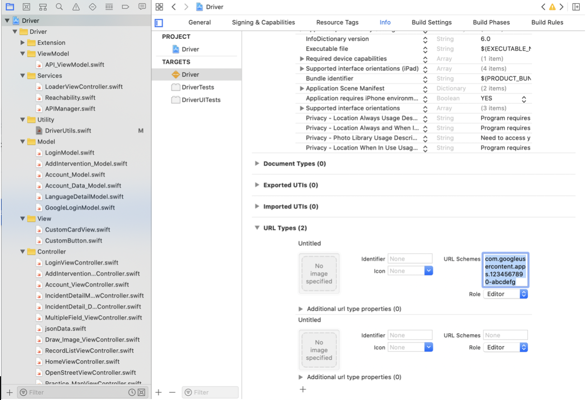

DRIVER Installation Guide Aventior, Inc.

DRIVER 2.0 iOS Installation Guide

*Take pull from Github/BitBucket.*

    git clone https://ami_bajwala@bitbucket.org/ami_bajwala/driver_ios.git

*Install Xcode Version 11.6*

*To download and setup all necessary SDKs, run*

    1 - Open terminal and type :
    
        sudo gem install cocoapods
    
    2 - Then in terminal cd to your Xcode project root directory (where your
    .xcodeproj file resides) and type: "pod install"

Next, open Login Driver.xcworkspace in XCode (not Login Driver.xcodeproj, since you need to
include the Cocoapod dependencies).

Now to change the base URL, go to “BASE\_URL” function of “DriverUtils.swift” file in the
“Utility” folder and change the MAIN\_URL.

*To setup Google auth*

    Click on the below link and follow the steps to create Client ID.
    
    https://developers.google.com/identity/sign-in/ios/start-integrating

2 Once all the steps are completed from the above link, copy and paste
the generated Client ID in appDelegate file and replace the existing
Client ID if any from appDelegate file.

*For adding Client ID*

*For adding reverse Client ID*

The reversed client ID is your client ID with the order of the dot-delimited fields
reversed. For example: com.googleusercontent.apps.1234567890-abcdefg

Reverse Client ID should be added to the URL Schemes under URL Types in

Info Tab against Driver Target

*After adding Client ID, reverse Client ID and all the pods are installed, user can either;*

    1 Run the application by selecting the device from the menu bar (for simulator).
    
    2 To run the application on an iOS device, connect the device to Mac using the USB
    cable, select the device from the menu bar and click on “Run” (icon) at the top menu bar.
